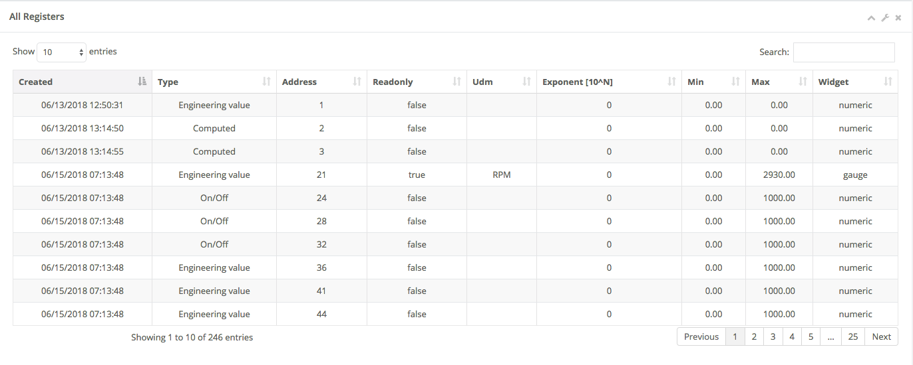
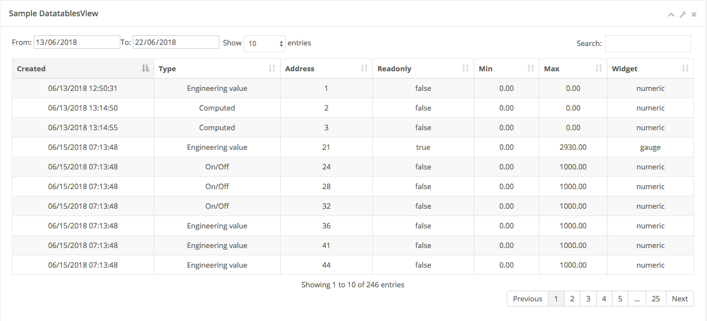
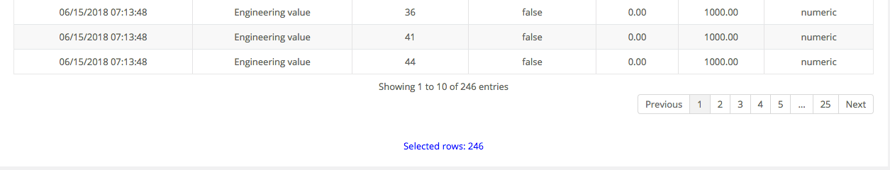
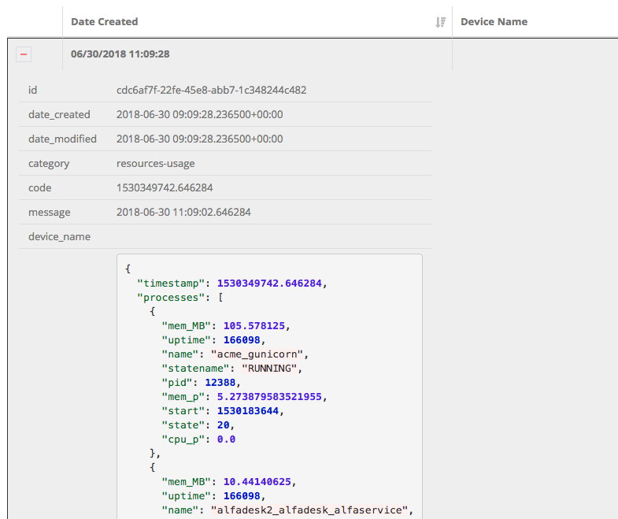

Django Datatables Server-Side
=============================

This package provides an easy way to process Datatables queries in the server-side mode.

Adapted from:

https://github.com/monnierj/django-datatables-server-side

Installation
------------

Install the package by running:

.. code:: bash

    pip install git+https://github.com/morlandi/django-datatables-view

then add 'datatables_view' to your INSTALLED_APPS:

.. code:: bash

    INSTALLED_APPS = [
        ...
        'datatables_view',
    ]

Pre-requisites
--------------

Your base template should include what required by `datatables.net`, plus:

- /static/datatables_view/css/style.css
- /static/datatables_view/js/datatables_utils.js

Example:

.. code:: html

    

        <link href="" rel="stylesheet" />

        <link rel='stylesheet' href=""></script>
        <link rel='stylesheet' href=""></script>

    

    

        

        
        
        
        
        
        
        
        
        

    

Basic DatatablesView
--------------------

To provide server-side rendering of a Django Model, you need a specific
view which will be called multiple times via Ajax during data navigation.

At the very minimum, you shoud specify a suitable `column_defs` list.

Example:

`urls.py`

.. code:: python

    from django.urls import path
    from . import datatables_views

    app_name = 'frontend'

    urlpatterns = [
        ...
        path('datatable/program/', datatables_views.ProgramDatatablesView.as_view(), name="datatable_program"),
    ]

`datatables_views.py`

.. code:: python

    from django.contrib.auth.decorators import login_required
    from django.utils.decorators import method_decorator

    from datatables_view.views import DatatablesView
    from backend.models import Register

    @method_decorator(login_required, name='dispatch')
    class RegisterDatatablesView(DatatablesView):

        model = Register
        title = 'Registers'

        column_defs = [
            {
                'name': 'id',
                'visible': False,
            }, {
                'name': 'created',
            }, {
                'name': 'type',
            }, {
                'name': 'address',
            }, {
                'name': 'readonly',
            }, {
                'name': 'min',
            }, {
                'name': 'max',
            }, {
                'name': 'widget_type',
            }
        ]

In the previous example, row id is included in the first column of the table,
but hidden to the user.

DatatablesView will serialize the required data during table navigation;
in order to render the initial web page which should contain the table,
you need another "application" view, normally based on a template.

In the template, insert a <table> element and connect it to the DataTable machinery,
as show below.

The first ajax call (identified by the `action=initialize` parameter) will render
the initial table layout, providing to DataTable the suitable columns specifications
(and other details) based on the `column_defs` previously defined.

`register_list.html`

.. code:: html

    <table id="datatable_register" width="100%" class="table table-striped table-bordered table-hover dataTables-example">
    </table>

    ...

    

This is the resulting table:

This strategy allows the placement of one or more dynamic tables in the same page.

In simpler situations, where only one table is needed, you can use a single view
(the one derived from DatatablesView); the rendered page is based on the default
template `datatables_view/database.html`, unless overridden.

Class attributes
----------------

Required:

- model
- column_defs

Optional:

- template_name = 'datatables_view/datatable.html'
- initial_order = [[1, "asc"]]
- length_menu = [[10, 20, 50, 100], [10, 20, 50, 100]]
- show_date_filters = None

or override the following methods to determine attributes value at run-time:

.. code:: python

    def get_column_defs(self):
        return self.column_defs

    def get_initial_order(self):
        return self.initial_order

    def get_length_menu(self):
        return self.length_menu

    def get_template_name(self):
        return self.template_name

column_defs customizations
--------------------------

Example::

    column_defs = [{
        'name': 'currency',
        'title': 'Currency',
        'searchable': True,
        'orderable': True,
        'visible': True,
        'foreign_field': 'manager__name',
        'placeholder': False,
        'className': 'css-class-currency',
        'defaultContent': '<h1>test</h1>',
    }, {
        ...

Notes:

    - **title**: if not supplied, the verbose name of the model column (when available)
      or **name** will be used

Computed (placeholder) columns
------------------------------

You can insert placeholder columns in the table, and feed their content with
arbitrary HTML.

Example:

.. code:: python

    @method_decorator(login_required, name='dispatch')
    class RegisterDatatablesView(DatatablesView):

        model = Register
        title = _('Registers')

        column_defs = [
            {
                'name': 'id',
                'visible': False,
            }, {
                'name': 'created',
            }, {
                'name': 'dow',
                'title': 'Day of week',
                'placeholder': True,
                'searchable': False,
                'orderable': False,
                'className': 'highlighted',
            }, {
                ...
            }
        ]

        def customize_row(self, row, obj):
            days = ['monday', 'tuesday', 'wednesday', 'thyrsday', 'friday', 'saturday', 'sunday']
            if obj.created is not None:
                row['dow'] = '<b>%s</b>' % days[obj.created.weekday()]
            else:
                row['dow'] = ''
            return

.. image:: screenshots/003.png

Add row tools as first column
-----------------------------

You can insert **DatatablesView.render_row_tools_column_def()** as the first element
in `column_defs` to obtain some tools at the beginning of each table row.

`datatables_views.py`

.. code:: python

    from django.contrib.auth.decorators import login_required
    from django.utils.decorators import method_decorator

    from datatables_view.views import DatatablesView
    from backend.models import Register

    @method_decorator(login_required, name='dispatch')
    class RegisterDatatablesView(DatatablesView):

        model = Register
        title = 'Registers'

        column_defs = [
            DatatablesView.render_row_tools_column_def(),
            {
                'name': 'id',
                'visible': False,
            }, {
            ...

By default, these tools will provide an icon to show and hide a detailed view
below each table row.

The tools are rendered according to the template **datatables_view/row_tools.html**,
which can be overridden.

Row details are automatically collected via Ajax by calling again the views
with a specific **?action=details** parameters, and will be rendered by the
method::

    def render_row_details(self, id, request=None)

which you can customize as needed

.. image:: screenshots/002.png

To activate row tools, you need to call **datatables_bind_row_tools()** helper
after each table refresh, as shown below:

.. code:: html

    <table id="datatable_register" width="100%" class="table table-striped table-bordered table-hover dataTables-example">
    </table>

    ...

    

Overridable DatatablesView methods
----------------------------------

get_initial_queryset()
......................

Provides the queryset to work with; defaults to **self.model.objects.all()**

Example:

.. code:: python

    def get_initial_queryset(self, request=None):
        if not request.user.view_all_clients:
            queryset = request.user.related_clients.all()
        else:
            queryset = super().get_initial_queryset(request)
        return queryset

customize_row()
...............

Called every time a new data row is required by the client, to let you further
customize cell content

Example:

.. code:: python

    def customize_row(self, row, obj):
        # 'row' is a dictionary representing the current row, and 'obj' is the current object.
        row['code'] = '<a class="client-status client-status-%s" href="%s">%s</a>' % (
            obj.status,
            reverse('frontend:client-detail', args=(obj.id,)),
            obj.code
        )
        if obj.recipe is not None:
            row['recipe'] = obj.recipe.display_as_tile() + ' ' + str(obj.recipe)
        return

render_row_details()
....................

Renders an HTML fragment to show table row content in "detailed view" fashion,
as previously explained in **Add row tools as first column**.

Example:

.. code:: python

    def render_row_details(self, id, request=None):
        client = self.model.objects.get(id=id)
        ...
        return render_to_string('frontend/pages/includes/client_row_details.html', {
            'client': client,
            ...
        })

Debugging
---------

In case of errors, Datatables.net shows an alert popup:

.. image:: screenshots/006.png

You can change it to trace the error in the browser console, insted:

.. code:: javascript

    // change DataTables' error reporting mechanism to throw a Javascript
    // error to the browser's console, rather than alerting it.
    $.fn.dataTable.ext.errMode = 'throw';

All details of Datatables.net requests can be logged to the console by activating
this setting::

    DATATABLES_VIEW_ENABLE_QUERYDICT_TRACING = True

The resulting query (before pagination) can be traced as well with::

    DATATABLES_VIEW_ENABLE_QUERYSET_TRACING = True

.. image:: screenshots/007.png

App settings
------------

DATATABLES_VIEW_MAX_COLUMNS

    Default: 30

DATATABLES_VIEW_ENABLE_QUERYDICT_TRACING

    When True, enables debug tracing of datatables requests

    Default: False

DATATABLES_VIEW_ENABLE_QUERYSET_TRACING

    When True, enables debug tracing of resulting query

    Default: False

Filter data by date range
-------------------------

When the model provides a get_latest_by field (self.model._meta, 'get_latest_by'),
DatatablesView receives and elaborates additional parameters to further filter queryset on
date range (unless show_date_filters is set to False).

You are responsible for providing the necessary user interface tools as follows:

.. code:: javascript

    

A 
 element is added to the top of the table, and later
populated with datepicker widgets.

After change, the table is redrawn, including datepickers values in the Ajax request.

The DatatablesView does the rest.

Adding extra info to table footer
---------------------------------

A **footer_callback_message()** method is provided to enrich table footer with
custom informations.

You must override it to define the content to be show; for example:

.. code:: python

    def footer_callback_message(self, qs, params):
        return 'Selected rows: %d' % qs.count()

and link a specific html element to the "footerCallback" signal:

.. code:: html

    <table id="datatable" width="100%" class="table table-striped table-bordered table-hover dataTables-example">
    </table>
    

.. code:: javascript

    

Generic tables
--------------

Chances are you might want to supply a standard user interface for listing
several models.

In this case, it is possible to use a generic approach and avoid code duplications,
as detailed below.

First, we supply a generic view which receives a model as parameter,
and passes it to the template used for rendering the page:

file `frontend/datatables_views.py`:

.. code:: python

    @login_required
    def object_list_view(request, model, template_name="frontend/pages/object_list.html"):
        return render(request, template_name, {
            'model': model,
        })

In the urlconf, link to specific models as in the example below:

file `frontend/urls.py`:

.. code:: python

    path('canali/', datatables_views.object_list_view, {'model': cbrdb.models.Canale, }, name="canali-list"),

The template uses the `model` received in the context to display appropriate `verbose_name`
and `verbose_name_plural` attributes, and to extract `app_label` and `model_name`
as needed; unfortunately, we also had to supply some very basic helper templatetags,
as the `_meta` attribute of the model is not directly visible in this context.

.. code:: html

    
    

    
        <li>
            <a href=""></a>
        </li>
        <li class="active">
            <strong>{{model|model_verbose_name_plural}}</strong>
        </li>
    

    

        
        
            <h2></h2>
        

            

                <h5> {{ model|model_verbose_name_plural }}</h5>
                
                    <a href="#"></a>
                
            

            

                <table id="datatable" width="100%" class="table table-striped table-bordered table-hover dataTables-example">
                </table>
            

            
                <a href="#"></a>
            

        

    

    
        
    

The connection with the Django backend uses the following url::

    

from `urls.py`::

    # List any Model
    path('datatable/<str:app_label>/<str:model_name>/', datatables_views.object_datatable_view, name="object-datatable"),

object_datatable_view() is a lookup helper which navigates all DatatablesView-derived
classes in the module and selects the view appropriate for the specific model
in use:

file `frontend/datatables_views.py`:

.. code:: python

    import inspect

    def object_datatable_view(request, app_label, model_name):

        # List all DatatablesView in this module
        datatable_views = [
            klass
            for name, klass in inspect.getmembers(sys.modules[__name__])
            if inspect.isclass(klass) and issubclass(klass, DatatablesView)
        ]

        # Scan DatatablesView until we find the right one
        for datatable_view in datatable_views:
            model = datatable_view.model
            if (model is not None and (model._meta.app_label, model._meta.model_name) == (app_label, model_name)):
                view = datatable_view
                break

        return view.as_view()(request)

which for this example happens to be:

.. code:: python

    @method_decorator(login_required, name='dispatch')
    class CanaleDatatablesView(BaseDatatablesView):

        model = Canale
        title = 'Canali'

        column_defs = [
            DatatablesView.render_row_tools_column_def(),
            {
                'name': 'id',
                'visible': False,
            }, {
                'name': 'nome',
            }, {
                'name': 'codice',
            }
        ]

Snippets
--------

Workaround: Adjust the column widths of all visible tables
..........................................................

.. code:: javascript

    setTimeout(function () {
        datatables_adjust_table_columns();
    }, 1000);

or event better:

.. code:: javascript

    var table = element.DataTable({
        ...
        "drawCallback": function(settings) {
            setTimeout(function () {
                datatables_adjust_table_columns();
            }, 100);
        }

where:

.. code:: javascript

    function datatables_adjust_table_columns() {
        // Adjust the column widths of all visible tables
        // https://datatables.net/reference/api/%24.fn.dataTable.tables()
        $.fn.dataTable
            .tables({
                visible: true,
                api: true
            })
            .columns.adjust();
    }

Redraw all tables
.................

.. code:: javascript

    $.fn.dataTable.tables({
        api: true
    }).draw();

Redraw table holding the current paging position
................................................

.. code:: javascript

    table = $(element).closest('table.dataTable');
    $.ajax({
        type: 'GET',
        url: ...
    }).done(function(data, textStatus, jqXHR) {
        table.DataTable().ajax.reload(null, false);
    });

change DataTables' error reporting mechanism
............................................

.. code:: javascript

    // change DataTables' error reporting mechanism to throw a Javascript
    // error to the browser's console, rather than alerting it.
    $.fn.dataTable.ext.errMode = 'throw';

Application examples
--------------------

Customize row details by rendering prettified json fields
.........................................................

.. code:: python

    import jsonfield
    from datatables_view.views import DatatablesView
    from .utils import json_prettify

    class MyDatatablesView(DatatablesView):

        ...

        def render_row_details(self, id, request=None):

            obj = self.model.objects.get(id=id)
            fields = [f for f in self.model._meta.get_fields() if f.concrete]
            html = '<table class="row-details">'
            for field in fields:
                value = getattr(obj, field.name)
                if isinstance(field, jsonfield.JSONField):
                    value = json_prettify(value)
                html += '<tr><td>%s</td><td>%s</td></tr>' % (field.name, value)
            html += '</table>'
            return html

where:

.. code:: python

    import json
    from pygments import highlight
    from pygments.lexers import JsonLexer
    from pygments.formatters import HtmlFormatter
    from django.utils.safestring import mark_safe

    def json_prettify_styles():
        """
        Used to generate Pygment styles (to be included in a .CSS file) as follows:
            print(json_prettify_styles())
        """
        formatter = HtmlFormatter(style='colorful')
        return formatter.get_style_defs()

    def json_prettify(json_data):
        """
        Adapted from:
        https://www.pydanny.com/pretty-formatting-json-django-admin.html
        """

        # Get the Pygments formatter
        formatter = HtmlFormatter(style='colorful')

        # Highlight the data
        json_text = highlight(
            json.dumps(json_data, indent=2),
            JsonLexer(),
            formatter
        )

        # # remove leading and trailing brances
        # json_text = json_text \
        #     .replace('{\n', '') \
        #     .replace('}\n', '')

        # Get the stylesheet
        #style = ""
        style = ''

        # Safe the output
        return mark_safe(style + json_text)

Change row color based on row content
.....................................

.. image:: screenshots/010.png

First, we mark the relevant info with a specific CSS class, so we can search
for it later

.. code:: html

    column_defs = [
        ...
        }, {
            'name': 'error_counter',
            'title': 'errors',
            'className': 'error_counter',
        }, {
        ...
    ]

Have a callback called after each table redraw

.. code:: javascript

    var table = element.DataTable({
        ...
    });

    table.on('draw.dt', function(event) {
        onTableDraw(event);
    });

then change the rendered table as needed

.. code:: javascript

    var onTableDraw = function (event) {

        var html_table = $(event.target);
        html_table.find('tr').each(function(index, item) {

            try {
                var row = $(item);
                text = row.children('td.error_counter').first().text();
                var error_counter = isNaN(text) ? 0 : parseInt(text);

                if (error_counter > 0) {
                    row.addClass('bold');
                }
                else {
                    row.addClass('grayed');
                }
            }
                catch(err) {
            }

        });
    }

**or use a rowCallback as follows:**

.. code:: html

    var table = element.DataTable({

        ...
        "rowCallback": function(row, data) {
            // https://datatables.net/reference/option/rowCallback
            //console.log("row data: %o", data);
            $(row).addClass(data.read ? 'read' : 'unread');
        }
    });

This works even if the 'read' column we're interested in is actually not visible.

Modify table content on the fly (via ajax)
..........................................

.. image:: screenshots/008.png

Row details customization:

.. code:: javascript

    def render_row_details(self, id, request=None):

        obj = self.model.objects.get(id=id)
        html = '<table class="row-details">'
        html += "<tr><td>alarm status:</td><td>"
        for choice in BaseTask.ALARM_STATUS_CHOICES:
            # Lo stato corrente lo visualizziamo in grassetto
            if choice[0] == obj.alarm:
                html += '<b>%s</b>&nbsp;' % (choice[1])
            else:
                # Se non "unalarmed", mostriamo i link per cambiare lo stato
                # (tutti tranne "unalarmed")
                if obj.alarm != BaseTask.ALARM_STATUS_UNALARMED and choice[0] != BaseTask.ALARM_STATUS_UNALARMED:
                    html += '<a class="set-alarm" href="#" onclick="set_row_alarm(this, \'%s\', %d); return false">%s</a>&nbsp;' % (
                        str(obj.id),
                        choice[0],
                        choice[1]
                    )
        html += '</td></tr>'

Client-side code:

.. code:: javascript

    <script language="javascript">

        function set_row_alarm(element, task_id, value) {
            $("body").css("cursor", "wait");
            //console.log('set_row_alarm: %o %o %o', element, task_id, value);
            table = $(element).closest('table.dataTable');
            //console.log('table id: %o', table.attr('id'));

            $.ajax({
                type: 'GET',
                url: sprintf('/set_alarm/%s/%s/%d/', table.attr('id'), task_id, value),
                dataType: 'html'
            }).done(function(data, textStatus, jqXHR) {
                table.DataTable().ajax.reload(null, false);
            }).always(function( data, textStatus, jqXHR) {
                $("body").css("cursor", "default");
            });
        }

Server-side code:

.. code:: javascript

    urlpatterns = [
        ...
        path('set_alarm/<str:table_id>/<uuid:task_id>/<int:new_status>/',
            views.set_alarm,
            name="set_alarm"),
    ]

    @login_required
    def set_alarm(request, table_id, task_id, new_status):

        # Retrieve model from table id
        # Example table_id:
        #   'datatable_walletreceivetransactionstask'
        #   'datatable_walletcheckstatustask_summary'
        model_name = table_id.split('_')[1]
        model = apps.get_model('tasks', model_name)

        # Retrieve task
        task = get_object_by_uuid_or_404(model, task_id)

        # Set alarm value
        task.set_alarm(request, new_status)

        return HttpResponse('ok')

